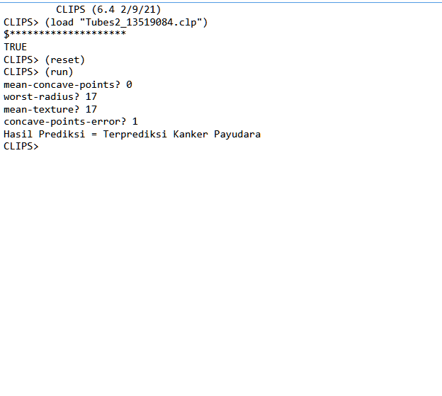

# CLIPS-predict-breast-cancer

Predict breast cancer using CLIPS decision tree

## Table of contents

-   [General info](#general-info)
-   [Screenshots](#screenshots)
-   [Technologies](#technologies)
-   [Setup and Run](#setup-and-run)
-   [Code Examples](#code-examples)
-   [Status](#status)
-   [Inspiration](#inspiration)
-   [Author](#author)

## General info

Predict breast cancer using CLIPS decision tree. This project was created to complete IF3170 Artificial Intelligence project assignment.

## Screenshots

## Technologies

-   CLIPS - version 6.4

## Setup and Run

-   Install CLIPS IDE version 6.4
-   Clone this repo into your computer
-   Open CLIPS IDE and click on tab **Environment > Load Constructs...**
-   Open `.clp` file in cloned folder from this repo
-   Type command `(reset)` then `(run)` to run this program

> **IMPORTANT!** You need to type the command manually or the program will not run

## Code Examples

-   `(facts)` - list all facts from memory
-   `(rules)` - list all rules from memory
-   `(clear)` - remove all facts from memory
-   `(ppdefrule <rulename>)` - view a rule code

## Status

Project is: _finished_

## Inspiration

Project inspired by IF3170 Artificial Intelligence project assignment, based on documentation prepared by Graphics and Artificial Intelligence Laboratory Assistant.

## Author

-   Benidictus Galih Mahar Putra
-   Made Kharisma Jagaddhita
-   Rhapsodya Piedro Asmorobangun
